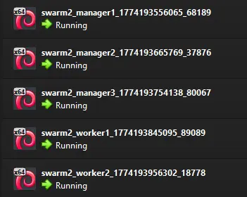

# Docker Swarm (Vagrant)

Escenario para **Docker Swarm** de **5 nodos** (3 *managers* + 2 *workers*).

## Características
- Utiliza el box personalizado `debian12-docker-dapw-ud5`. Este box está basado en Debian 12 y tiene Docker instalado, así como las actualizaciones a marzo de 2026.
- El escenario está pensado para desplegar en **VirtualBox**.

## Uso
- Descargar `debian12-docker_v1.box`.
- Importar el box a nuestro equipo: 
	```bash
	vagrant box add debian12-docker-dapw-ud5 debian12-docker_v1.box
	```
- Levantar las máquinas:
	```bash
	vagrant up
	```
	La salida del comando anterior debe ser [similar a la de este fichero](./assets/vagrant-up-output.txt).
	
	Ahora podemos ver en VirtualBox cinco máquinas nuevas:

	
- Nos podemos conectar a los equipos utilizando SSH (contraseña: `abc123.`):
	```bash
	# manager1
	ssh vagrant@192.168.57.10
	```
	```bash
	# manager2
	ssh vagrant@192.168.57.11
	```
	```bash
	# manager3
	ssh vagrant@192.168.57.12
	```
	```bash
	# worker1
	ssh vagrant@192.168.57.20
	```
	```bash
	# worker2
	ssh vagrant@192.168.57.21
	```